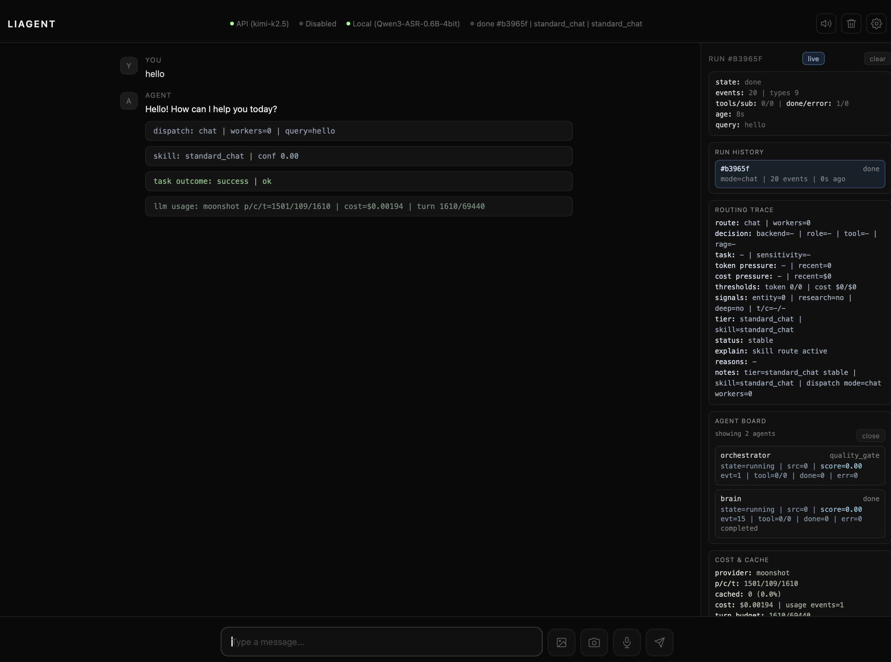
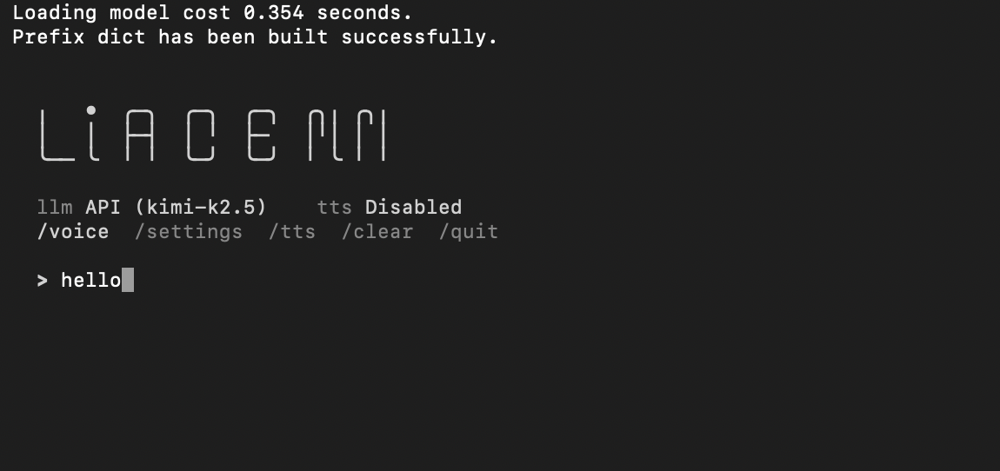
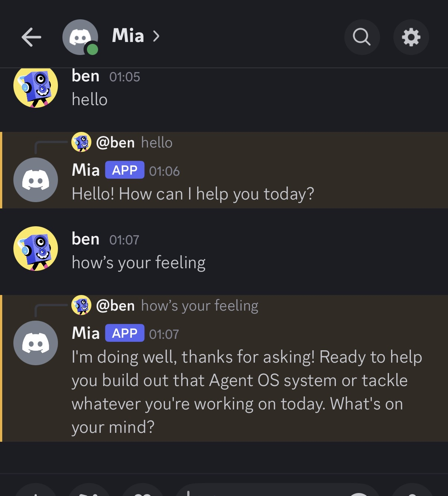

# LiAgent OS

[Back to landing page](README.md) | [Chinese README](./README%28%E4%B8%AD%E6%96%87%29.md)

> Build a private, local-first personal AI assistant with governed autonomy.

LiAgent OS is a local-first AI agent OS for building a private personal assistant with governed autonomy across local models and hybrid cloud services. It brings conversation, tool use, multi-agent orchestration, task scheduling, heartbeat execution, human approval, and auditability into one long-lived loop.

It is not trying to be another chat wrapper. The project is built around the harder problems that show up when agents need to operate in real workflows: long-running execution, recovery, controlled autonomy, permission boundaries, budget limits, and multi-surface delivery.

The long-term ambition is broader and more product-facing: LiAgent OS is being shaped into an all-around personal AI agent, one that can understand context, help manage ongoing work, monitor what matters, and act across everyday workflows without asking users to surrender privacy, safety, or control.

## Product Preview

### Web UI



### CLI



### Discord



## What problem it solves

Most AI apps are good at one-shot answers, but much weaker at the problems below:

- work that must continue across time instead of ending in one turn
- risky actions that should not happen silently in the background
- real routing across local models, cloud APIs, and hybrid model services
- runtime visibility into why the system acted, what tools it used, and what it cost

LiAgent OS exists to make long-lived agents more practical, inspectable, governable, and ultimately worthy of becoming a trusted personal AI operating layer.

## Long-term product direction

LiAgent OS is not positioning itself as a narrow automation bot or a thin chat shell. The long-range direction is a full-spectrum personal AI agent that can:

- research and summarize with traceable evidence
- monitor people, companies, markets, and topics over time
- remember user preferences and recurring patterns
- organize follow-up work instead of ending at a single answer
- act inside clear approval, privacy, and safety boundaries

In product terms, the vision is simple: **a capable personal AI assistant that feels more useful over time, not more risky over time.**

## What already works

- Interact with the agent through CLI, Web, or Discord.
- Run tools, decompose complex tasks, parallelize sub-tasks, and synthesize results.
- Schedule cron jobs, delayed jobs, file-triggered jobs, and heartbeat cycles.
- Receive approval cards for higher-risk actions in Web and Discord.
- Fall back into API bootstrap mode when local models are missing.
- Track runtime events, routing traces, cache and cost signals, task results, and audit records.
- Move toward a governed semi-autonomous loop with behavior signals, interest monitoring, goal storage, and reflection.

## Project stage and direction (2026-03)

LiAgent OS is already beyond the toy-demo stage, but it is not pretending to be a one-click consumer product either. The project is in the transition from "it can run for real" to "it can run reliably for long-lived workflows."

| Stage | Status | Notes |
| --- | --- | --- |
| Conversation + tool use | Core loop in place | Multi-surface interaction, tool execution, policy routing, and event flow are working. |
| Long-running execution + recovery | Integrated into the main path | Task queues, failure taxonomy, checkpoint matching, and resume flows are wired in. |
| Governed semi-autonomy | Actively evolving | Heartbeat, interest monitoring, goal storage, and reflection loops are live and still being hardened. |
| Local and hybrid model service optimization | Next focus | The next phase pushes local-model quality, hybrid routing, latency/cost efficiency, privacy safeguards, and practical long-running reliability. |

In one sentence: **LiAgent OS already has real runtime capability, and the next phase is about turning that capability into a more private, secure, local-model-first foundation for a serious personal AI agent.**

Current public baseline: **`v0.1.2` (alpha)**.

## Current boundaries

LiAgent OS already has meaningful runtime capability, but the public promise is intentionally narrower than the long-term vision.

- It is an alpha runtime, not a zero-config consumer product.
- The easiest first run is API bootstrap mode, not a full local-model setup.
- Local-first paths are real, but still need model assets, hardware-fit choices, and manual validation.
- Governed autonomy is a core direction, but the project is not claiming "silent full autonomy" without approvals, policies, or audit trails.

See [docs/current-limitations.md](docs/current-limitations.md) for the current public boundary in one place.

## Who it is for

- Developers building local-first or hybrid agent runtimes.
- Teams exploring governed autonomy, human approval, and auditability.
- People who want agents to research, monitor, organize, and follow up over time without losing control.
- Builders who believe the strongest personal AI products will be local-first, privacy-conscious, and safety-governed by design.

If you expect a zero-config, zero-model, instant SaaS experience, that is not the current position of the project.

## 5-minute quick start (recommended first successful run)

For a first run, start with **API bootstrap mode**. It is the friendliest path for new users and does not require local model assets up front.

If you want the shortest possible walkthrough with a success checklist, follow [docs/getting-started.md](docs/getting-started.md) first.

### 1. Install

```bash
cd /path/to/liagent_git
python3 -m venv venv
./venv/bin/pip install -e .
```

Optional extras:

```bash
./venv/bin/pip install -e '.[browser]'
./venv/bin/pip install -e '.[discord]'
./venv/bin/pip install -e '.[mcp]'
```

### 2. Copy config templates

```bash
cp config.example.json config.json
cp .env.example .env
```

### 3. Fill only the minimum API config

In `.env`, start with:

```bash
LLM_API_KEY=your_api_key
# Optional:
# LLM_API_BASE_URL=https://api.openai.com/v1
# LLM_API_MODEL=gpt-4o
```

### 4. Start the Web UI

```bash
./venv/bin/liagent --web --host 127.0.0.1 --port 8080
```

Then open [http://127.0.0.1:8080](http://127.0.0.1:8080).

### 5. Why this path is the easiest

`config.example.json` still defaults to local-first settings, but LiAgent validates local model paths on startup. If the paths are missing and you provided `LLM_API_KEY`, it can switch into API bootstrap mode automatically and save a working configuration.

That means the first goal is simply to get the system running, not to solve MLX, local model directories, and TTS/STT assets before you even see the product.

## Local-first advanced path

If you want a fully local or hybrid setup, fill these fields in `config.json`:

- `llm.local_model_path`
- `tts.local_model_path`
- `stt.model`

Then either switch `runtime_mode` to `local_private` or keep `hybrid_balanced`.

Apple Silicon + MLX is currently the best local-first path for this project.

Common config points:

| Config | Purpose |
| --- | --- |
| `runtime_mode` | `local_private` / `hybrid_balanced` / `cloud_performance` |
| `llm.backend` | `local` or `api` |
| `tasks.enabled` | enable the long-running task system |
| `tasks.cwork_dir` | working directory boundary for agent-accessible files |
| `routing.*` | routing, code delegation, long-context thresholds |
| `budget.*` | token and USD limits |
| `sandbox.*` | sandbox execution settings |

## What you see after startup

- A Web chat UI with runtime events, not just messages.
- A Settings panel for runtime modes, LLM/TTS/STT backends, tool policy, and MCP configuration.
- A task system for creating jobs, viewing runs, pausing/resuming, and receiving heartbeat confirmations.
- Timeline and runtime data for dispatch, sub-agents, tools, synthesis, budget, and artifacts.

If you prefer the terminal, you can launch CLI mode directly:

```bash
./venv/bin/liagent
# or
./venv/bin/python -m liagent
```

If you want confirmation flows delivered to Discord:

```bash
LIAGENT_DISCORD_TOKEN=<your_discord_token> \
LIAGENT_WS_URL=ws://localhost:8080/ws/chat \
LIAGENT_WEB_TOKEN=<your_web_token> \
./venv/bin/liagent --discord
```

When `--host` is not loopback, set `LIAGENT_WEB_TOKEN`.

## Example uses

If you open the project and do not know what to ask first, try prompts like these:

- `Summarize the AI agent releases from this week that are worth tracking.`
- `Watch AAPL and TSLA every morning and tell me only when something materially changes.`
- `Break this request into an execution plan, research first, then give me the final proposal.`
- `Ask me before any file writes, command execution, or higher-risk actions.`

LiAgent OS is built less for flashy chat and more for research, monitoring, organization, and follow-through inside one governed runtime.

## Capability map

### 1. Models and routing

- Local-first inference with API fallback and hybrid routing.
- Provider registration and protocol routing across OpenAI-style and local paths.
- Prompt caching with tiered TTL policies.
- Dual observability for token budgets and USD budgets.
- A roadmap that increasingly favors stronger local-model usage where privacy, control, and reliability matter most.

### 2. Execution and orchestration

- Multi-agent research flow: decomposition, parallel work, progressive synthesis, final synthesis.
- Delegated coding flow: `coder -> verifier -> synthesis`.
- Failure taxonomy, retry budgets, checkpoint matching, and resume.

### 3. Long-running tasks and semi-autonomy

- Built-in task queue for cron, delayed once, and file-change triggers.
- Heartbeat loop with structured candidate actions, deduplication, budget passing, and confirmation cleanup.
- Goal and reflection loops with `GoalStore`, behavior signals, interest monitoring, and suggestion delivery.

### 4. Multi-surface interaction and observability

- CLI / Web / Discord delivery surfaces.
- Web timeline, runtime event rendering, artifact drawer, and task result push.
- REST + WebSocket APIs for config, tasks, interests, health, and push channels.

### 5. Safety and governance

- High-risk tool confirmation, audit logs, and output redaction.
- Tool profiles: `minimal | research | full`.
- Tool trust registry so untrusted MCP servers are not silently connected.
- File access boundaries around `tasks.cwork_dir` with budgets and policy gates.
- Ongoing hardening toward privacy-first personal assistant behavior rather than convenience-first hidden automation.

## Repository layout

```text
src/liagent/
  agent/          # core loops, goals/tasks/heartbeat, recovery
  engine/         # LLM / TTS / STT routing and engine management
  knowledge/      # retrieval and knowledge injection
  orchestrator/   # multi-agent orchestration
  tools/          # tools, policy, trust registry, executors
  ui/             # CLI / Web / Discord / API routes
  voice/          # voice-related capabilities
  skills/         # skill routing and assets
  utils/          # shared utilities
tests/            # core unit and regression tests
tests/integration/  # browser, Discord, voice, VLM, and e2e coverage
tests/manual/       # live/manual validation scripts outside default pytest runs
docs/getting-started.md   # first successful run guide
docs/current-limitations.md  # public boundaries and current rough edges
docs/architecture.md  # public architecture overview
docs/roadmap.md       # public roadmap and release direction
```

## Development validation

Minimum validation aligned with current CI:

```bash
PYTHONPATH=src ./venv/bin/python -m compileall -q src
PYTHONPATH=src ./venv/bin/python -m pytest -q \
  tests/test_events.py \
  tests/test_skill_router_simplified.py \
  tests/test_health.py \
  tests/test_brain_layers.py \
  tests/test_web_event_envelope.py \
  tests/test_tool_parsing.py
```

Full regression:

```bash
PYTHONPATH=src ./venv/bin/python -m pytest -q
```

## Public docs and governance

- License: [LICENSE](LICENSE)
- Contribution guide: [CONTRIBUTING.md](CONTRIBUTING.md)
- Security policy: [SECURITY.md](SECURITY.md)
- Support guide: [SUPPORT.md](SUPPORT.md)
- Code of conduct: [CODE_OF_CONDUCT.md](CODE_OF_CONDUCT.md)
- First successful run: [docs/getting-started.md](docs/getting-started.md)
- Current boundaries: [docs/current-limitations.md](docs/current-limitations.md)
- Architecture overview: [docs/architecture.md](docs/architecture.md)
- Public roadmap: [docs/roadmap.md](docs/roadmap.md)

## Troubleshooting

- Model path errors on startup
  - Check the `llm / tts / stt` paths in `config.json`, or switch to API bootstrap mode.
- Web access fails outside localhost
  - Confirm `LIAGENT_WEB_TOKEN` is set and verify your host / port / firewall settings.
- `web_fetch`-style capabilities are missing
  - Install the `.[browser]` extra and finish Playwright setup.
- Discord does not receive approval cards
  - Check `LIAGENT_DISCORD_TOKEN`, `LIAGENT_WS_URL`, and `LIAGENT_WEB_TOKEN`.
